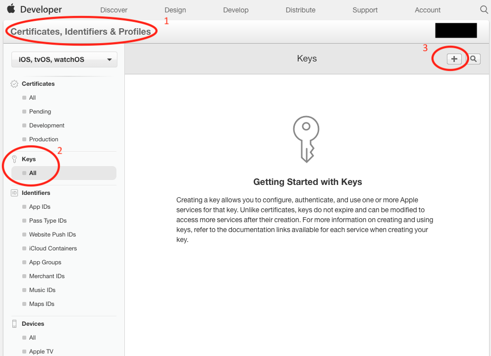
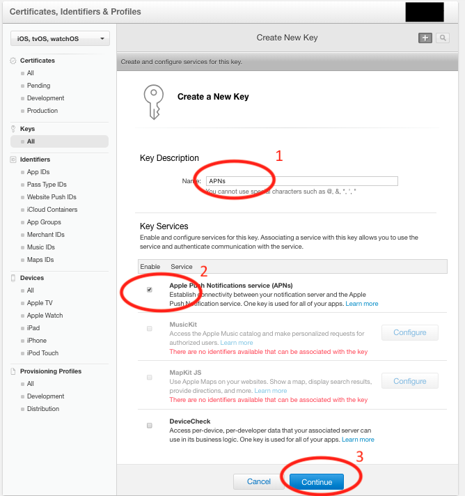
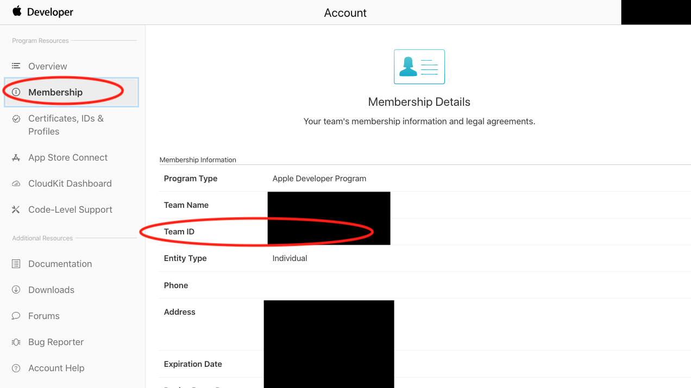
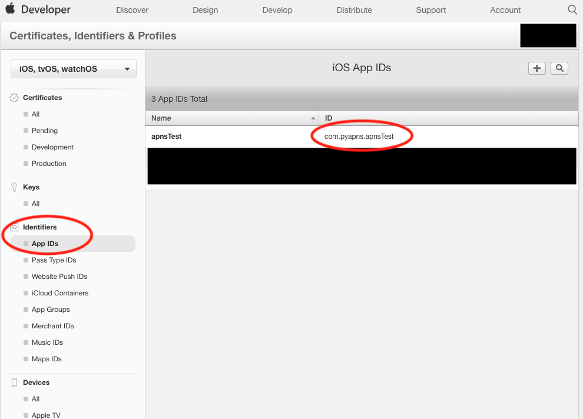
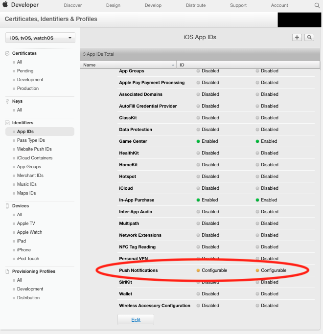

############################################
Setup Token-based APNs (Apple Push Notification service)
############################################

This setup is for Token-based provider connection trust based on `Apple document`_.

login your apple developer account

- Go to **Certificates, Identifiers & Profiles**
- Click **Keys**
- Click **+** button

- Enter **Name**
- Check **Appl  Push Notification service**
- Click **Continue** button

- Click **Confirm** button

.. image:: nstatic/images/key_3.png

- Record your **Key ID**. It will be need for config.json file later.
- Click **Download** button. 
  The .p8 file will be used for config.json file later.

.. image:: nstatic/images/key_4.png

- Go to **Account**
- Select **Membership**
- Record  your **Team ID**. It will be need for config.json file later.

- Go to **Certificates, Identifiers & Profiles**
- Select **App ID**
- Record the **ID** for your APNs project.
  App ID will be used for config.json file later.

- Also, check if **Push Notification** is enable.

.. _Apple document: https://developer.apple.com/library/archive/documentation/NetworkingInternet/Conceptual/RemoteNotificationsPG/APNSOverview.html